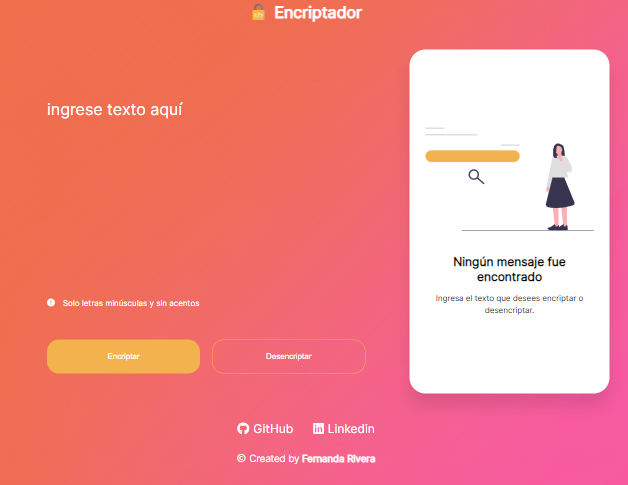

# Text Encryptor App
This is a Oracle ONE challenge.

This application encrypts texts, so you can exchange secret messages with other people who know the secret of the encryption used.

  The encryption "keys" used are the following:

  - The letter "e" is converted to "enter"
  - The letter "i" is converted to "imes"
  - The letter "a" is converted to "ai"
  - The letter "o" is converted to "ober"
  - The letter "u" is converted to "ufat"

## Table of contents

- [Overview](#overview)
  - [Screenshot](#screenshot)
  - [Links](#links)
- [My process](#my-process)
  - [Built with](#built-with)
- [Author](#author)

## Overview

### Screenshot

### Links

- Solution URL: [Add solution URL here](https://your-solution-url.com)
- Live Site URL: [Add live site URL here](https://your-live-site-url.com)

### Built with

- Semantic HTML5 markup
- CSS custom properties
- Flexbox
- JavaScript

## Author

- GitHub - [Fernanda Rivera](https://github.com/Ferrriver)
- LinkedIn - [Fernanda Rivera](https://www.linkedin.com/in/fernandariverarico/)
